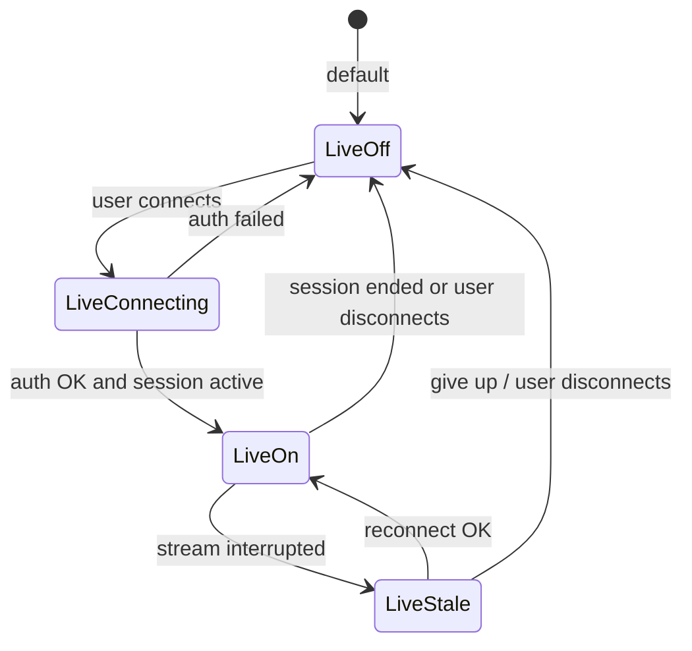

# F1 Stalker (v2 draft)

> **Status:** Draft. Captures features and tasks scoped out of [.specs/v1.md](./v1.md) (and originally deferred from v0/v1 planning). Not approved for implementation.

## Overview

F1 Stalker v2 builds on v1: cross-platform distribution, rival mode, themes, sprint grid, notifications, tray/background, and onboarding. v2 is the home for **live data**, **sync**, and **deeper race-weekend experiences** that v1 intentionally excludes.

**Baseline:** v0 (M0&ndash;M6) and v1 (M7&ndash;M10) are prerequisites.

**Source:** Items moved here from v1 **Out**, post-v1 user stories (US12, US13), and the deferred **M14** live-data milestone from earlier planning.

---

## Features

### Live data and race weekend

- Optional authenticated OpenF1 access (paid subscription, user-provided)
- Live session clock, positions, and timing during active sessions
- Live or near-live track conditions when the API exposes them during a session
- Team radio playback or transcript summaries (subset TBD)
- Telemetry summaries for pinned drivers (lap times, sectors, speed traps; not a full engineer console)
- UI clearly distinguishes **live** vs **historical** sources; graceful fallback to v1 behaviour when live is off or auth fails

<!-- DECISION: Minimum live feature set for v2.0 — positions + timing only, or include radio and telemetry in the first slice? -->

### Multi-device sync

- Sync pins, settings, theme choice, and notification prefs across devices
- Conflict resolution when two devices edit pins offline

<!-- DECISION: Sync backend — self-hosted (user provides folder/WebDAV), optional F1 Stalker cloud, or file export/import only for v2? -->

### Race companion (beyond dashboard)

- Session-aware view during race weekends: live order, gaps, pit stops (as API allows)
- Optional mini timing tower for pinned drivers
- Post-session debrief: result, fastest lap, points gained

**Not in v2 (remain out):** 3D track map, full telemetry explorer, betting/fantasy.

### Distribution extras

- Docker image for headless CI, smoke tests, or API cache warming (GUI not supported in container by default)

### Platforms (future)

- Mobile companion (read-only dashboard)
- Web client (read-only or PWA)

**Not in v2 (remain out):** replacing desktop apps with web-only.

### Social and accounts

- Optional F1 Stalker account for sync and backup
- Share chart screenshot or season summary image (no in-app social feed)

**Not in v2 (remain out):** official F1 licensing claims, betting, fantasy leagues, prediction markets.

---

## Tech stack

| Layer | v1 | v2 change |
| ----- | -- | --------- |
| OpenF1 | historical only | openf1-client extended for OAuth + live endpoints |
| Credentials | n/a | OS keychain preferred; token refresh in background |
| Sync | n/a | TBD: CRDT file sync, simple cloud API, or export bundle |
| Live UI | n/a | polling or SSE/WebSocket per OpenF1 live API shape |
| Radio | n/a | audio stream or text summaries via OpenF1 if available |
| Docker | n/a | optional multi-stage image; no GUI in default image |

---

## Data access policy

### Historical (unchanged)

Free OpenF1 historical data (2023+), unauthenticated, ~24h latency. Remains the **default** for all users.

### Real-time (opt-in)

Per [OpenF1 docs](https://openf1.org/docs/), live data requires authentication and a **paid subscription**. v2 treats live data as opt-in:

- User enables "Live data" in settings and completes OAuth (or flow supported by openf1-client)
- Credentials stored in OS keychain where available; never logged or committed
- When live is disabled, expired, or unreachable: fall back to historical + cache (v1 behaviour)
- Live polling/streaming only while app is foreground, background-tray (if user enabled), or during an active session window the user opted into
- UI copy labels live vs delayed data on every live panel

<!-- DECISION: Confirm OpenF1 commercial tier, pricing, and token lifetime before implementation. -->

---

## Glossary

All v0/v1 terms apply. Additions:

| Term | Meaning |
| ---- | ------- |
| **Live data** | Authenticated OpenF1 stream with near-real-time latency during sessions. |
| **Live mode** | User setting + valid credentials; enables live endpoints. |
| **Sync bundle** | Portable export of settings, pins, and prefs for manual transfer (minimum sync story). |
| **Race companion** | Session-focused UI surface beyond the season dashboard. |
| **Timing tower** | Compact live classification list for selected drivers. |

---

## User stories

| ID | As a… | I want to… | So that… | Scope |
| --- | ----- | ---------- | -------- | ----- |
| US12 | fan | enable live timing and session data during a race weekend | I can follow the session without a 24h delay | v2 |
| US13 | user | sync pins and settings across devices | my setup follows me | v2 |
| US14 | fan | see live positions and gaps for pinned drivers during a session | I know where they are on track now | v2 |
| US15 | fan | hear or read team radio clips for pinned drivers | I catch key moments without the broadcast | v2 (optional) |
| US16 | user | export and import my configuration | I can move setup between machines without a cloud account | v2 (minimum sync) |
| US17 | operator | run a Docker image for smoke tests or cache warming | CI can validate API integration headlessly | v2 (optional) |
| US18 | fan | open a race companion view on session day | I have one place for live order, pits, and results | v2 |

Stories US1&ndash;US11, USF1&ndash;USF5, US6.x, US8, US9.x, US10 remain owned by v0/v1.

---

## Acceptance criteria

### Live data (US12, US14) — M14

- [ ] Settings: connect / disconnect OpenF1 live account
- [ ] OAuth or credential flow documented; errors shown in plain language
- [ ] When connected during an active session: show live session clock and classification for pinned drivers (minimum)
- [ ] Live badge on affected UI; automatic downgrade to historical when session ends or auth expires
- [ ] Background tray (if enabled in v1): optional reduced live poll rate; user toggle
- [ ] No live API calls when live mode is off

<!-- DECISION: Live positions only for v2.0, or also lap-by-lap telemetry charts? -->

### Telemetry and radio (US15) — M15

- [ ] If OpenF1 exposes radio URLs or transcripts: list recent messages for pinned drivers
- [ ] If telemetry endpoints exist: show last lap time, sector deltas, and top speed for pinned drivers
- [ ] Graceful empty state when endpoint unavailable for current session
- [ ] Bandwidth-conscious defaults (no auto-play radio without user action)

### Race companion (US18) — M16

- [ ] Entry from dashboard when current meeting is in progress or within user-defined pre-session window
- [ ] Live timing tower (pinned drivers highlighted) when live mode on
- [ ] Historical fallback: last known grid + "Live unavailable" when live off
- [ ] Post-session: session result row for pinned drivers (reuse `session_result` classification)

### Multi-device sync (US13, US16) — M17

- [ ] **Minimum:** Export/import settings bundle (JSON or encrypted file): pins, theme, notification prefs, timezone
- [ ] **Stretch:** Automatic sync via user-chosen backend (iCloud/Dropbox folder, WebDAV, or F1 Stalker account)
- [ ] Last-write-wins or explicit merge UI on conflict
- [ ] No sync of OpenF1 credentials unless user explicitly opts in

<!-- DECISION: Is file export/import enough for v2.0, with automatic sync in v2.1? -->

### Docker (US17) — M18 (optional)

- [ ] Published image runs `f1-stalker --smoke` or equivalent: fetch calendar, exit 0
- [ ] Document: no GUI, no keychain; historical API only in container
- [ ] Not required for desktop end users

### Weather (live)

- [ ] When live weather samples exist for active session: track column may show "Live" sample with timestamp
- [ ] Forecast column unchanged (Open-Meteo)

### Data freshness

- [ ] Live panels show last live tick time
- [ ] Historical panels retain v1 timestamps and stale behaviour

---

## Data contract

### OpenF1 endpoints (additions for v2)

| F1 Stalker concern | openf1-client resource | Notes |
| ------------------ | ---------------------- | ----- |
| Live session clock | TBD | Align with OpenF1 live API when subscription confirmed |
| Live positions | TBD | M14 |
| Live timing / laps | TBD | M14/M15 |
| Team radio | TBD | M15 if exposed |
| Car telemetry | TBD | M15 if exposed |
| Live weather | `weather` | If live stream differs from historical poll |

All types live in **openf1-client** first.

### F1 Stalker domain models (additions)

| Model | Purpose |
| ----- | ------- |
| `LiveSessionState` | Connection status, session key, last live tick, auth expiry |
| `LiveStanding` | Position, gap, lap, pit status for one driver |
| `RadioClip` | URL or transcript snippet + timestamp |
| `TelemetrySnapshot` | Last lap sectors, speeds for pinned driver |
| `SyncBundle` | Versioned export of user prefs and pins |
| `SyncConflict` | Conflicting pin order or settings fields |

### SQLite (additions)

| Table | Contents |
| ----- | -------- |
| `credentials` | Keychain reference id only; no raw tokens in DB when keychain available |
| `live_prefs` | Auto-connect, poll interval, session-only live |
| `sync_state` | Last export hash, remote revision id if cloud sync |

---

## State machine

### Live mode (parallel to v1 lifecycle)

| Flag | UI behaviour |
| ---- | ------------ |
| **LiveOff** | v1 historical-only UI |
| **LiveOn** | Live badges; race companion enabled |
| **LiveStale** | Show last live tick; retry with backoff |

v1 states (`Background`, `Notify`, etc.) unchanged; live polling may continue in `Background` if user allows.

---

## Milestones

| Milestone | Goal | Deliverables |
| --------- | ---- | ------------ |
| **M14** | Live data core | OAuth, live clock + positions for pinned drivers (US12, US14) |
| **M15** | Telemetry and radio | Optional radio + telemetry panels (US15) |
| **M16** | Race companion | Session-day view + timing tower (US18) |
| **M17** | Sync | Export/import bundle; stretch: automatic sync (US13, US16) |
| **M18** | Docker (optional) | Headless smoke image (US17) |

<!-- DECISION: v2.0 ships M14 only, or M14+M17 export/import together? -->

Suggested order: **M14 → M16 → M15 → M17 → M18**.

---

## v2 scope (draft)

**In (candidate)**

- Opt-in authenticated OpenF1 live data (US12)
- Live positions and session clock for pinned drivers (US14)
- Race companion view for active weekends (US18)
- Settings/credentials via OS keychain
- Export/import sync bundle at minimum (US16)
- Automatic multi-device sync if backend decision is made (US13)
- Optional telemetry and radio (US15)
- Optional Docker smoke image (US17)
- Live track weather when API supports it

**Out (remain future or never)**

- Multi-device sync without at least manual export/import (unless M17 stretch ships)
- Full race engineer telemetry UI
- 3D track map and car animation
- Mobile and web clients (listed as v2 draft features but likely v3 unless reprioritized)
- F1 Stalker-operated cloud requiring ongoing infra (unless explicitly approved)
- Betting, fantasy, predictions
- Official constructor branding / licensing
- Docker as default distribution for desktop users

**Known limitations (document in UI)**

- Live data requires user-owned OpenF1 subscription; F1 Stalker does not sell API access
- Live quality and fields depend on OpenF1; features degrade when endpoints are missing
- Radio may be geo-restricted or delayed vs broadcast
- Sync conflicts may require manual merge unless automatic CRDT is built
- Docker image is for operators/CI, not casual fans

---

## Traceability (v1 → v2)

| Scoped out of v1 | v2 home |
| ---------------- | ------- |
| Authenticated / paid OpenF1 (US12) | M14 |
| Multi-device sync (US13) | M17 |
| Docker images | M18 (optional) |
| Full race companion | M16 (+ M15 for depth) |
| Mobile / web clients | Platforms (future); not milestone-assigned |
| Social / cloud accounts | M17 stretch only |
| Live timing, telemetry, positions, radio (v0 Out) | M14, M15 |
| Betting / fantasy / predictions | Remains out |
