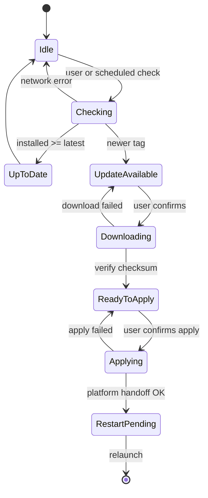
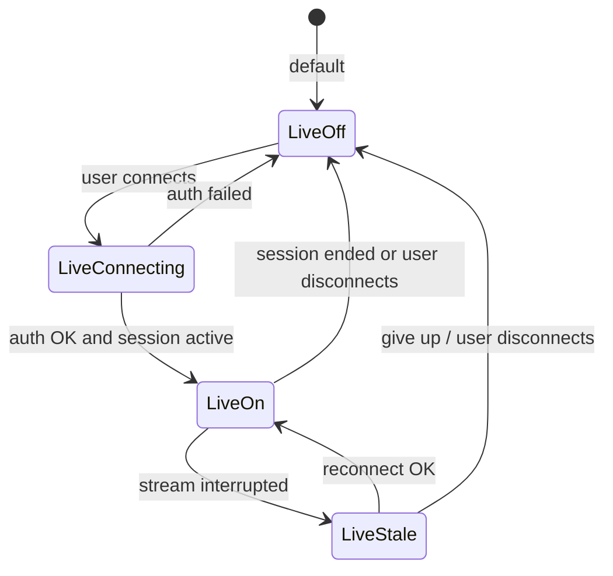

# F1 Stalker (v0.2.0 draft)

> **Status:** Draft. Captures features and tasks scoped out of v0.1.x and earlier planning. Not approved for implementation.

## Overview

F1 Stalker v0.2.0 builds on the shipped v0.1.x line: season **dashboard** (race triplet, countdown, **season calendar**), **pinned drivers**, **standings table**, **rival mode** / **Compare rivals**, championship charts, quali/sprint grids, weather, themes (presets + custom), notifications, tray/background, first-run onboarding, and cross-platform distribution via GitLab Releases.

v0.2.0 is the home for **in-app updates**, **user configuration backup**, **live OpenF1 data**, **multi-device sync**, and **deeper race-weekend experiences** that v0.1.x intentionally excludes.

**Baseline:** [.specs/v0.0.0.md](./v0.0.0.md) and [.specs/v0.1.0.md](./v0.1.0.md) are delivered through **v0.1.3** (see [.specs/v0.1.3.md](./v0.1.3.md) for the season calendar). v0.2.0 does not remove v0.1.x behaviour unless explicitly superseded below.

**Source:** Items deferred from v0.1.0 **Out** (US12, US13), post-v0.1.0 planning, and new operator/user quality-of-life goals (self-update, config backup).

### Implementation status (current tree, pre&ndash;v0.2.0)

| Area | Status | Notes |
| ---- | ------ | ----- |
| Historical dashboard | Shipped | Race triplet, countdown, pins, charts, standings, weather, cache |
| Season calendar | Shipped (v0.1.3) | Month grid, session-day highlights, tooltip popovers |
| Distribution | Shipped | GitLab Releases + site downloads; `RELEASE.md` documents local build flow |
| Live OpenF1 | Not started | US12 deferred from v0.1.0 |
| Self-update | Not started | Manual download only today |
| Config backup/loader | Not started | SQLite only; no export/import bundle |

---

## Features

### In-app version updater and self-updater (M11)

- **Update check:** compare running app version (`Cargo.toml` / About) against latest [GitLab Release](https://gitlab.com/aaanh/f1-stalker/-/releases) (or project site `APP_VERSION` as fallback)
- **Notify** when a newer semver is available; dismissible banner or Settings row
- **Release notes** snippet (changelog section for that tag, or link to GitLab release page)
- **Download** the correct artifact for current OS and CPU architecture (macOS universal/arm64 DMG, Windows zip, Linux tarball) from GitLab Release assets or site mirror under `f1-stalker-site/public/downloads/`
- **Self-update (apply):** after download, replace the running install where the platform allows:
  - **macOS:** replace `.app` bundle or prompt user to open downloaded DMG (Gatekeeper-safe flow documented)
  - **Windows:** replace portable zip contents or staged installer path
  - **Linux:** replace binary inside user-chosen install dir or tarball extract path
- **Restart** prompt after successful apply; single-instance hands off to new binary
- **Offline / errors:** silent skip when check fails; no blocking modal on startup
- Does **not** auto-update without explicit user action (no silent background upgrades)

<!-- DECISION: Check GitLab Releases API only, or also hit the project site? Prefer GitLab API as canonical per RELEASE.md. -->

### User configuration backup and loader (M12)

- **Export backup** to a versioned file (JSON or encrypted JSON): all user-owned state needed to restore the dashboard on a fresh install
- **Import / load backup** from file with preview and explicit confirm (replace vs merge policy TBD)
- **Minimum payload:**
  - `settings` key-value store (timezone, theme, `font_scale`, notification prefs, `background_on_close`, `include_testing`, rival pair, `standings_tab`, `standings_mode`, etc.)
  - **Pinned drivers** list and order
  - **Custom theme** (`custom_theme` colours)
- **Exclude** from default backup: OpenF1 response cache blobs, asset cache files, dedupe notification keys tied to one machine (optional advanced toggle)
- **Schema version** field in bundle for forward-compatible import
- Settings UI: **Export backup…** and **Import backup…** with native file picker
- Plain-language errors on version mismatch or corrupt file
- Complements (does not require) cloud sync (US13)

<!-- DECISION: Default import = full replace of pins + settings, or merge pins with conflict UI? -->

### Live data core (M13)

- Optional authenticated OpenF1 access (paid subscription, user-provided credentials)
- **Live mode** during active sessions: session clock, positions, timing for **pinned drivers**
- Live or near-live track conditions when the API exposes them during a session
- UI clearly distinguishes **live** vs **historical** sources; graceful fallback to v0.1.x behaviour when live is off or auth fails

<!-- DECISION: Minimum live feature set for v0.2.0 — positions + timing only, or include radio and telemetry in the first slice? -->

### Race companion (M14)

- Session-aware view during race weekends: live order, gaps, pit stops (as API allows)
- Optional mini **timing tower** for pinned drivers
- Post-session debrief: result, fastest lap, points gained

**Not in v0.2.0 (remain out):** 3D track map, full telemetry explorer, betting/fantasy.

### Telemetry and radio (M15)

- Team radio playback or transcript summaries (subset TBD)
- Telemetry summaries for pinned drivers (lap times, sectors, speed traps; not a full engineer console)

### Multi-device sync (M16, stretch)

- Stretch goal on top of backup/loader: automatic sync of pins, settings, theme, and notification prefs across devices
- Conflict resolution when two devices edit pins offline

<!-- DECISION: Sync backend — self-hosted (user provides folder/WebDAV), optional F1 Stalker cloud, or file backup/loader only for v0.2.0? -->

### Distribution extras (M17, optional)

- Docker image for headless CI, smoke tests, or API cache warming (GUI not supported in container by default)
- Self-update uses existing GitLab Release artifacts; no separate update CDN required for v0.2.0

### Platforms (future)

- Mobile companion (read-only dashboard)
- Web client (read-only or PWA)

**Not in v0.2.0 (remain out):** replacing desktop apps with web-only.

### Social and accounts

- Optional F1 Stalker account for sync and backup (stretch only)
- Share chart screenshot or season summary image (no in-app social feed)

**Not in v0.2.0 (remain out):** official F1 licensing claims, betting, fantasy leagues, prediction markets.

---

## Tech stack

| Layer | v0.1.x | v0.2.0 change |
| ----- | ------ | ------------- |
| Language | Rust | unchanged |
| UI | Iced | update UI, backup import/export flows |
| Database | SQLite (`settings`, pins, caches) | backup bundle schema; no raw token storage in DB |
| OpenF1 | openf1-client (historical) | extend openf1-client for OAuth + live endpoints |
| Credentials | n/a | OS keychain preferred; token refresh in background |
| Updates | manual download | GitLab Releases API + platform-specific apply |
| Sync / backup | n/a | versioned `ConfigBackup` JSON; stretch: cloud/WebDAV |
| Live UI | n/a | polling or SSE/WebSocket per OpenF1 live API shape |
| Radio | n/a | audio stream or text summaries via OpenF1 if available |
| Docker | n/a | optional multi-stage image; no GUI in default image |
| Site | static Vite site; changelog fetched from GitLab | may expose `APP_VERSION` for update check fallback |

---

## Data access policy

### Historical (unchanged)

Free OpenF1 historical data (2023+), unauthenticated, ~24h latency. Remains the **default** for all users.

UI copy: e.g. &ldquo;Data via OpenF1 (approx. 24h delay)&rdquo;.

### Real-time (opt-in)

Per [OpenF1 docs](https://openf1.org/docs/), live data requires authentication and a **paid subscription**. v0.2.0 treats live data as opt-in:

- User enables **Live data** in Settings and completes OAuth (or flow supported by openf1-client)
- Credentials stored in OS keychain where available; never logged, committed, or included in config backup by default
- When live is disabled, expired, or unreachable: fall back to historical + cache (v0.1.x behaviour)
- Live polling/streaming only while app is foreground, background-tray (if user enabled), or during an active session window the user opted into
- UI copy labels live vs delayed data on every live panel

<!-- DECISION: Confirm OpenF1 commercial tier, pricing, and token lifetime before implementation. -->

---

## Glossary

All v0 / v0.1.x terms apply (race triplet, **season calendar**, **RacePhase**, **Compare rivals**, standings table, sprint grid, etc.). Additions:

| Term | Meaning |
| ---- | ------- |
| **Live data** | Authenticated OpenF1 stream with near-real-time latency during sessions. |
| **Live mode** | User setting + valid credentials; enables live endpoints. |
| **Config backup** | Versioned export file of settings, pins, and custom theme (user configs). |
| **Config loader** | Import flow that restores a config backup into SQLite. |
| **Update check** | Background or manual fetch comparing installed semver to latest GitLab Release. |
| **Self-update** | User-initiated download and apply of a newer release artifact for this OS/arch. |
| **Sync bundle** | Alias for config backup when used for manual machine transfer; may gain cloud sync metadata later. |
| **Race companion** | Session-focused UI surface beyond the season dashboard. |
| **Timing tower** | Compact live classification list for selected drivers. |

---

## User stories

| ID | As a&hellip; | I want to&hellip; | So that&hellip; | Scope | Milestone |
| --- | ----- | ---------- | -------- | ----- | --------- |
| US24 | user | be notified when a newer app version is available | I do not have to check GitLab Releases manually | v0.2.0 | M11 |
| US25 | user | download and apply an update from inside the app | I stay current without hunting for the right artifact | v0.2.0 | M11 |
| US21 | user | export and import a configuration backup file | I can restore pins, theme, and settings on another machine or after reinstall | v0.2.0 | M12 |
| US12 | fan | enable live timing and session data during a race weekend | I can follow the session without a 24h delay | v0.2.0 | M13 |
| US19 | fan | see live positions and gaps for pinned drivers during a session | I know where they are on track now | v0.2.0 | M13 |
| US23 | fan | open a race companion view on session day | I have one place for live order, pits, and results | v0.2.0 | M14 |
| US20 | fan | hear or read team radio clips for pinned drivers | I catch key moments without the broadcast | v0.2.0 (optional) | M15 |
| US13 | user | sync pins and settings across devices automatically | my setup follows me without manual files | v0.2.0 (stretch) | M16 |
| US22 | operator | run a Docker image for smoke tests or cache warming | CI can validate API integration headlessly | v0.2.0 (optional) | M17 |

Stories US1&ndash;US11, USF1&ndash;USF5, US6.x, US8, US9.x, US10, and **US14&ndash;US17** (season calendar) remain owned by v0 / v0.1.x.

---

## Acceptance criteria

Criteria are grouped in **milestone delivery order** (M11&ndash;M17). v0.1.x ends at M10.

### In-app updater and self-updater (US24, US25) — M11

- [ ] Settings (or About): **Check for updates**; shows current version and latest release tag
- [ ] Optional background check on startup (user toggle; default off or once per day)
- [ ] When newer version exists: banner or Settings notice with release title and link to notes
- [ ] **Download update** picks correct asset for OS + arch from GitLab Release (or site mirror)
- [ ] Progress and error states; resumable or retry on failure
- [ ] **Apply update** requires explicit confirmation; documents Gatekeeper / admin needs per platform
- [ ] Restart or relaunch into new version after successful apply
- [ ] No update check phone-home beyond GitLab/site endpoints the user already trusts for downloads
- [ ] Downgrade and same-version: clear &ldquo;You are up to date&rdquo; copy

### User configuration backup and loader (US21) — M12

- [ ] Settings: **Export backup…** writes versioned bundle to user-chosen path
- [ ] Settings: **Import backup…** reads bundle; shows summary (pin count, theme, timezone) before apply
- [ ] Bundle includes: all `settings` keys, pinned drivers (order preserved), `custom_theme`
- [ ] Bundle excludes OpenF1/cache blobs by default
- [ ] Import restores dashboard behaviour without wipe of cache (cache rebuilds on refresh)
- [ ] Invalid or future schema version: block import with actionable error
- [ ] Export/import work on macOS, Windows, and Linux with native file dialogs
- [ ] Optional: export excludes notification dedupe keys / machine-local state (documented)

### Live data (US12, US19) — M13

- [ ] Settings: connect / disconnect OpenF1 live account
- [ ] OAuth or credential flow documented; errors shown in plain language
- [ ] When connected during an active session: show live session clock and classification for pinned drivers (minimum)
- [ ] **Live** badge on affected UI; automatic downgrade to historical when session ends or auth expires
- [ ] Background tray (if enabled): optional reduced live poll rate; user toggle
- [ ] No live API calls when live mode is off

<!-- DECISION: Live positions only for v0.2.0, or also lap-by-lap telemetry charts? -->

### Race companion (US23) — M14

- [ ] Entry from dashboard when current meeting is in progress or within user-defined pre-session window
- [ ] Live timing tower (pinned drivers highlighted) when live mode on
- [ ] Historical fallback: last known grid + &ldquo;Live unavailable&rdquo; when live off
- [ ] Post-session: session result row for pinned drivers (reuse `session_result` classification)

### Telemetry and radio (US20) — M15

- [ ] If OpenF1 exposes radio URLs or transcripts: list recent messages for pinned drivers
- [ ] If telemetry endpoints exist: show last lap time, sector deltas, and top speed for pinned drivers
- [ ] Graceful empty state when endpoint unavailable for current session
- [ ] Bandwidth-conscious defaults (no auto-play radio without user action)

### Multi-device sync (US13) — M16 (stretch)

- [ ] Builds on M12 config backup format
- [ ] Automatic sync via user-chosen backend (iCloud/Dropbox folder, WebDAV, or F1 Stalker account)
- [ ] Last-write-wins or explicit merge UI on conflict
- [ ] No sync of OpenF1 credentials unless user explicitly opts in

<!-- DECISION: Is file backup/loader (M12) enough for v0.2.0, with automatic sync in a later minor? -->

### Docker (US22) — M17 (optional)

- [ ] Published image runs `f1-stalker --smoke` or equivalent: fetch calendar, exit 0
- [ ] Document: no GUI, no keychain; historical API only in container
- [ ] Not required for desktop end users

### Weather (live)

- [ ] When live weather samples exist for active session: track column may show **Live** sample with timestamp
- [ ] Forecast column unchanged (Open-Meteo)

### Data freshness

- [ ] Live panels show last live tick time
- [ ] Historical panels retain v0.1.x timestamps and stale behaviour

---

## Data contract

### OpenF1 endpoints (additions for v0.2.0)

| F1 Stalker concern | openf1-client resource | Notes |
| ------------------ | ---------------------- | ----- |
| Live session clock | TBD | Align with OpenF1 live API when subscription confirmed |
| Live positions | TBD | M13 |
| Live timing / laps | TBD | M13/M15 |
| Team radio | TBD | M15 if exposed |
| Car telemetry | TBD | M15 if exposed |
| Live weather | `weather` | If live stream differs from historical poll |

All types live in **openf1-client** first; F1 Stalker does not duplicate serde types.

### GitLab / distribution (additions)

| Concern | Source | Notes |
| ------- | ------ | ----- |
| Latest version | `GET /api/v4/projects/:id/releases/permalink/latest` | Tag + assets list |
| Release notes | Release description or `CHANGELOG.md` at tag | Shown in update UI |
| Artifacts | GitLab Release assets or `f1-stalker-site/public/downloads/vX.Y.Z/` | Same filenames as `RELEASE.md` |

### F1 Stalker domain models (additions)

| Model | Purpose |
| ----- | ------- |
| `UpdateInfo` | Latest tag, published_at, release notes URL, per-platform download URL + checksum |
| `UpdateProgress` | Download bytes, apply step, error |
| `ConfigBackup` | Versioned export: settings map, pins, custom theme metadata |
| `ConfigBackupSummary` | Human-readable import preview |
| `LiveSessionState` | Connection status, session key, last live tick, auth expiry |
| `LiveStanding` | Position, gap, lap, pit status for one driver |
| `RadioClip` | URL or transcript snippet + timestamp |
| `TelemetrySnapshot` | Last lap sectors, speeds for pinned driver |
| `SyncConflict` | Conflicting pin order or settings fields (stretch) |

### SQLite (additions)

| Table / key | Contents |
| ----- | -------- |
| `settings` | `update_check_enabled`, `update_last_check_at`, `update_dismissed_tag`, `backup_last_export_at` (optional) |
| `credentials` | Keychain reference id only; no raw tokens in DB when keychain available |
| `live_prefs` | Auto-connect, poll interval, session-only live |
| `sync_state` | Last export hash, remote revision id if cloud sync (stretch) |

Config backup file is **not** a SQLite table; it is a portable JSON (or encrypted) document.

---

## State machine

### Update flow

### Live mode (parallel to v0.1.x lifecycle)

| Flag | UI behaviour |
| ---- | ------------ |
| **LiveOff** | v0.1.x historical-only UI |
| **LiveOn** | Live badges; race companion enabled |
| **LiveStale** | Show last live tick; retry with backoff |

v0.1.x states (`Background`, `Notify`, `FirstRun`, etc.) unchanged; live polling may continue in `Background` if user allows.

---

## Milestones

Continues v0.1.x numbering (M7&ndash;M10 shipped). Order reflects **dependencies**: platform plumbing first, live stack next, stretch goals last.

| Order | Milestone | Goal | Deliverables | Depends on |
| ----- | --------- | ---- | ------------ | ---------- |
| 1 | **M11** | In-app updates | Version check, download, apply, restart (US24, US25) | v0.1.x distribution |
| 2 | **M12** | Config backup/loader | Export/import user configs (US21) | &mdash; |
| 3 | **M13** | Live data core | OAuth, live clock + positions for pinned drivers (US12, US19) | openf1-client live API |
| 4 | **M14** | Race companion | Session-day view + timing tower (US23) | M13 |
| 5 | **M15** | Telemetry and radio | Optional radio + telemetry panels (US20) | M13 (M14 UI optional) |
| 6 | **M16** | Auto sync (stretch) | Multi-device sync (US13) | M12 |
| 7 | **M17** | Docker (optional) | Headless smoke image (US22) | &mdash; |

**Delivery order:** M11 &rarr; M12 &rarr; M13 &rarr; M14 &rarr; M15 &rarr; M16 &rarr; M17.

M17 may run in parallel with M11&ndash;M12 (operator-only); it is listed last because it does not unblock desktop users.

<!-- DECISION: Ship M11+M12 as v0.2.0 before M13 live data, or one combined v0.2.0? -->

---

## v0.2.0 scope (draft)

**In (candidate, by milestone)**

- **M11:** In-app update check and self-update from GitLab Releases (US24, US25)
- **M12:** User configuration backup export and import loader (US21)
- **M13:** Opt-in authenticated OpenF1 live data; live positions and session clock for pinned drivers (US12, US19); Settings/credentials via OS keychain
- **M14:** Race companion view for active weekends (US23)
- **M15:** Optional telemetry and radio (US20); live track weather when API supports it
- **M16:** Automatic multi-device sync if backend decision is made (US13 stretch)
- **M17:** Optional Docker smoke image (US22)

**Out (remain future or never)**

- Silent/auto background updates without user confirmation
- Bundling OpenF1 API access (user brings own subscription)
- Multi-device sync without at least manual backup/loader (M12 is minimum)
- Full race engineer telemetry UI
- 3D track map and car animation
- Mobile and web clients (listed as future; likely post&ndash;v0.2.0 unless reprioritized)
- F1 Stalker-operated cloud requiring ongoing infra (unless explicitly approved)
- Betting, fantasy, predictions
- Official constructor branding / licensing
- Docker as default distribution for desktop users

**Known limitations (document in UI)**

- Self-update may require manual steps on macOS (Gatekeeper, drag-to-Applications)
- Config backup does not transfer cached OpenF1 data; first refresh after import may be slow
- Live data requires user-owned OpenF1 subscription; F1 Stalker does not sell API access
- Live quality and fields depend on OpenF1; features degrade when endpoints are missing
- Radio may be geo-restricted or delayed vs broadcast
- Sync conflicts may require manual merge unless automatic CRDT is built (stretch)
- Docker image is for operators/CI, not casual fans

---

## Traceability (v0.1.x → v0.2.0)

| Deferred from v0.1.x / earlier | v0.2.0 home |
| ------------------------------ | ----------- |
| Authenticated / paid OpenF1 (US12) | M13 |
| Multi-device sync (US13) | M16 (stretch) |
| Manual config portability (implicit) | M12 (US21) |
| Manual release download only | M11 (US24, US25) |
| Docker images | M17 (optional) |
| Full race companion | M14 (+ M15 for depth) |
| Mobile / web clients | Platforms (future) |
| Social / cloud accounts | M16 stretch only |
| Live timing, telemetry, positions, radio | M13, M15 |
| Betting / fantasy / predictions | Remains out |
| Season calendar (US14&ndash;US17) | **Shipped v0.1.3** — not v0.2.0 |
