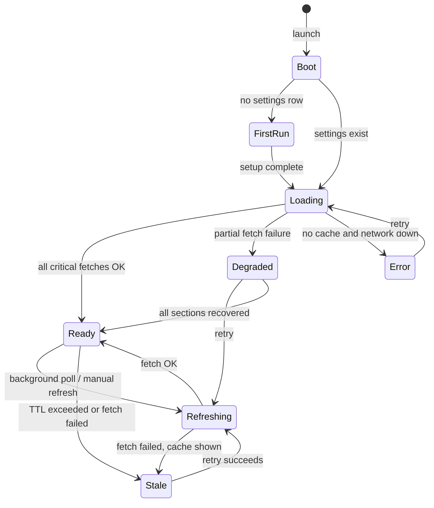

# F1 Stalker

## Overview

F1 Stalker is a native desktop app that gives you the current season information on a cool, nice, modern-looking dashboard.

## Features

- Homepage
  - gives overview on the immediate previous, current, and upcoming races:
    - Where: country, GP name, circuit name
    - When
    - Weather (forecast + track conditions; see [Weather](#weather))
  - Pin drivers to follow their progression throughout the season
    - Show a card group of pinned drivers portrait + name
    - Tabbed navigation
      - Show a graph with grand prixes on the X-axis, Drivers' Championship standing on the Y-axis
      - Show another with Constructors' Championship on the Y-axis
    - During a race weekend, show driver's starting position (time diff from P1 if not pole) after quali is done
  - Countdown to next race: practices, qualifiers, actual race

## Tech stack

- Language: Rust
- App framework: [Iced](https://iced.rs/)
- Database: SQLite
- API library: [openf1-client](https://gitlab.com/aaanh/openf1-client) (local path dependency for now)
- Forecast API: [Open-Meteo](https://open-meteo.com/) (free, no API key)

## Data access policy

F1 Stalker uses **historical OpenF1 data only**. No OAuth, no paid real-time subscription.

Per [OpenF1 docs](https://openf1.org/docs/), historical data (2023+) is free and unauthenticated. It is published with roughly **24 hours latency** from real time. The app must not assume same-day session results, grids, or standings during an active race weekend.

UI copy should set expectations: e.g. "Data via OpenF1 (approx. 24h delay)".

---

## Glossary

Terms used in this spec and in F1 / OpenF1 data.

| Term                           | Meaning                                                                                                                                         |
| ------------------------------ | ----------------------------------------------------------------------------------------------------------------------------------------------- |
| **Season**                     | A championship year (e.g. 2026). Runs from the first Grand Prix to the last.                                                                    |
| **Grand Prix (GP)**            | A single race event. Often used interchangeably with "race" in casual speech, but in data it usually means the whole weekend.                   |
| **Meeting**                    | OpenF1's name for a Grand Prix weekend. One `meeting_key` per GP (e.g. Monaco GP 2026). Contains multiple sessions.                             |
| **Session**                    | One timed on-track activity within a meeting: Practice 1, Qualifying, Race, etc. Identified by `session_key`.                                   |
| **Race weekend**               | The span from the first session (`date_start`) to the last session (`date_end`) of a meeting.                                                   |
| **Round**                      | Championship round number (1, 2, 3, …). Derived from meeting order in the calendar, not a separate OpenF1 field.                                |
| **Practice (FP1, FP2, FP3)**   | Untimed or low-stakes running sessions before qualifying. FP2/FP3 are dropped on sprint weekends.                                               |
| **Qualifying (Quali)**         | Timed session that sets the **race** starting grid. On sprint weekends this is the Saturday afternoon session, distinct from Sprint Qualifying. |
| **Sprint Qualifying**          | Sprint-weekend only. Sets the grid for the **Sprint** race, not the Grand Prix.                                                                 |
| **Sprint**                     | A short race on sprint weekends (Saturday). Uses its own grid from Sprint Qualifying.                                                           |
| **Race**                       | The Grand Prix itself (Sunday). Championship points are awarded here.                                                                           |
| **Starting grid**              | Ordered list of grid positions before a session. OpenF1 `/starting_grid` for Qualifying describes the **race** grid.                            |
| **Pole / P1**                  | First place on the grid (position 1).                                                                                                           |
| **Drivers' Championship**      | Points standings for individual drivers across the season.                                                                                      |
| **Constructors' Championship** | Points standings for teams across the season.                                                                                                   |
| **Driver number**              | Permanent car number (e.g. 44). Stable identifier for pinning; use this, not driver name.                                                       |
| **Session type**               | OpenF1 category: `Practice`, `Qualifying`, `Race`, etc. Broader than `session_name`.                                                            |
| **Session name**               | Specific label: `Practice 1`, `Qualifying`, `Sprint Qualifying`, `Sprint`, `Race`, …                                                            |
| **Track conditions**           | Measured at the circuit during a session (air/track temp, rain, wind). OpenF1 `/weather`.                                                       |
| **Forecast**                   | Predicted weather at the circuit location before/during the weekend. Open-Meteo API.                                                              |
| **Historical data**            | OpenF1 data available without auth, ~24h behind live. All F1 Stalker OpenF1 usage.                                                              |
| **Real-time data**             | Live OpenF1 feed (paid, authenticated). **Out of scope** for v1.                                                                                |

### Weekend formats

|                         | **Standard weekend**                | **Sprint weekend**                                                                     |
| ----------------------- | ----------------------------------- | -------------------------------------------------------------------------------------- |
| **Typical sessions**    | FP1 → FP2 → FP3 → Qualifying → Race | FP1 → Sprint Qualifying → Sprint → Qualifying → Race                                   |
| **Countdown**           | All five sessions                   | All five sessions                                                                      |
| **Race grid source**    | `starting_grid` after `Qualifying`  | `starting_grid` after `Qualifying` (Saturday GP quali, not Sprint Qualifying)          |
| **Sprint grid**         | N/A                                 | From Sprint Qualifying; **not shown in v1**                                            |
| **Championship update** | After `Race` session                | After `Race` session (sprint points are separate; standings still update after Sunday) |

---

## User stories

| ID | As a… | I want to… | So that… | Scope |
| --- | ----- | ---------- | -------- | ----- |
| US1 | fan | see the previous, current, and upcoming Grand Prix at a glance | I know where the season is without digging through a calendar | v1 |
| US2 | fan | see a countdown to the next session (FP, quali, race) | I know when the next on-track action starts | v1 |
| US3 | fan | see forecast and track-side weather side by side for each GP | I can compare predicted conditions with what was recorded at the circuit | v1 |
| US4 | fan | switch between Drivers' and Constructors' championship charts | I can follow both title fights across the season | v1 |
| US5 | fan | see quali grid position and gap to pole for my pinned drivers | I know how they start the race after qualifying | v1 |
| US6 | user | open the app and still see the last fetched data when offline | a bad connection does not leave me with a blank screen | v1 |
| US0 | user | download a portable build for my CPU architecture (arm64 / x86_64) | I can run the app without installing dependencies | post-v1 |
| USF1 | user | have a desktop, launcher, or Docker icon | I can open the app readily | post-v1 |
| USF2 | user | be guided through first-run setup (timezone, optional pins) | the dashboard works correctly without reading docs | v1 |
| USF3 | fan | see who leads or has won the Drivers' Championship | I get a clear season narrative at a glance (e.g. title fight or confirmed winner) | v1 |
| USF4 | fan | use a rival mode view with exactly two drivers | I can compare two drivers head-to-head across the season (e.g. Verstappen vs Hamilton) | post-v1 |
| USF5 | fan | pin drivers and see their championship progress on a chart | I can follow my favourite drivers through the season | v1 |
| US6.1 | user | choose a theme from a default set of constructor livery colours | the app matches my team preference without manual tuning | post-v1 |
| US6.2 | user | create a custom theme | the dashboard looks the way I want | post-v1 |
| US7 | user | have my configuration and settings saved between sessions | I do not repeat setup every time I open the app | v1 |
| US8 | user | receive desktop notifications about races or pinned drivers | I am reminded of upcoming sessions or results without keeping the window open | post-v1 |
| US9.1 | user | keep the app running in the menu bar, taskbar, or as a background service when I close the window | it stays available without occupying my desktop | post-v1 |
| US9.2 | user | restore the main window from the background tray/service | I can return to the dashboard quickly | post-v1 |
| US9.3 | user | quit the app completely instead of sending it to the background | I can free resources when I am done | post-v1 |

---

## Acceptance criteria

### Homepage race overview

- [ ] Three cards shown: **previous**, **current**, **upcoming** meeting (per race triplet algorithm)
- [ ] Each card shows country flag, GP name (`meeting_name`), circuit name (`circuit_short_name`), and date range
- [ ] Cancelled meetings (`is_cancelled`) are excluded from the triplet
- [ ] **Current** card shows a visual "weekend in progress" indicator when `date_start <= now <= date_end`
- [ ] Off-season: upcoming is first GP of season; previous is last completed GP; copy explains no active weekend
- [ ] First GP of season: previous card shows empty state (not an error)

### Countdown

- [ ] Countdown targets the next session of the **upcoming** meeting where `date_start > now`
- [ ] Label includes session name (e.g. "Practice 1", "Qualifying", "Race")
- [ ] Standard and sprint weekends list all sessions in schedule order
- [ ] Updates at least every minute; shows days, hours, minutes (seconds optional)
- [ ] Times respect user timezone preference (default: system local)
- [ ] When no future session exists but meeting is active: show "Schedule pending"
- [ ] After last session of a meeting: countdown advances to next meeting's first session

### Pinned drivers

- [ ] User can pin up to **6** drivers by `driver_number`
- [ ] Pinned drivers shown as portrait + name (acronym or `full_name`) in a horizontal card group
- [ ] Pins persist in SQLite across restarts (`pinned_drivers` table)
- [ ] User can unpin and reorder pins
- [ ] Driver picker populated from latest season session's `/drivers` list
- [ ] Headshot load failure shows fallback (silhouette + team colour ring)
- [ ] With zero pins: chart area shows prompt to pin drivers; quali row hidden

### Championship charts

- [ ] Tabbed UI: **Drivers'** and **Constructors'** championship
- [ ] X-axis: GP round (derived from race session order); Y-axis: championship **position**
- [ ] Y-axis inverted so P1 is at the top
- [ ] Drivers tab: one line per pinned driver, coloured by `team_colour`
- [ ] Constructors tab: top 10 teams by latest standing
- [ ] Data point added only after each **Race** session appears in OpenF1 (~24h delay)
- [ ] Missing rounds omitted (no interpolation across gaps)
- [ ] Empty early season: chart shows axes with no lines or "No race data yet"

### Quali grid

- [ ] Shown only for **pinned** drivers during the **current/upcoming** meeting after GP Qualifying
- [ ] Uses `starting_grid` from Qualifying session (`session_name == "Qualifying"`, not Sprint Qualifying)
- [ ] Displays grid position; pole shows "Pole"; others show gap to P1 from `lap_duration` delta
- [ ] Hidden until OpenF1 grid data exists; placeholder: "Grid not available yet"
- [ ] Hidden after user has no pins or meeting has no quali session in schedule

### Weather

- [ ] Each race card shows two columns: **Forecast** (Open-Meteo) and **Track conditions** (OpenF1)
- [ ] Forecast uses `location` + `country_name` from meeting; cached with TTL (~3h)
- [ ] Pre-weekend / no OpenF1 samples: forecast shown; track column reads "No session data yet"
- [ ] After sessions exist: track column shows latest `/weather` sample for most recent completed session
- [ ] API failure in one column does not block the other

### First-run and settings (USF2, US7)

- [ ] First launch shows setup flow: timezone, optional initial pins
- [ ] Settings sheet/modal: edit timezone, clear cache, manage pins
- [ ] All settings persist in SQLite

### Data freshness and errors

- [ ] Banner or footer: "Data via OpenF1 (approx. 24h delay)" plus last successful fetch time
- [ ] Stale cache used when network fails; stale indicator visible
- [ ] Per-section error states (not full-app crash) for failed API calls
- [ ] App opens to skeleton UI within 2s; data loads asynchronously

---

## Data contract

Types for OpenF1 responses are owned and maintained by **openf1-client** (Rust `serde` structs in `sdks/rust/openf1/src/models.rs`, generated from the same contract as `packages/sdk-core` Zod schemas). F1 Stalker imports those types and adds its own domain/view models only where the UI needs a different shape.

**Boundary:** openf1-client handles HTTP, query building, and response typing. F1 Stalker owns calendar logic (race triplet, countdown), chart assembly, pinning, caching, Open-Meteo integration, and all UI state.

### OpenF1 endpoints used (via openf1-client)

| F1 Stalker concern                | openf1-client resource | Key fields used                                                                                                                                                                                                           |
| --------------------------------- | ---------------------- | ------------------------------------------------------------------------------------------------------------------------------------------------------------------------------------------------------------------------- |
| Season calendar                   | `meetings`             | `meeting_key`, `meeting_name`, `meeting_official_name`, `country_name`, `country_code`, `country_flag`, `location`, `circuit_short_name`, `circuit_image`, `date_start`, `date_end`, `gmt_offset`, `is_cancelled`, `year` |
| Session schedule                  | `sessions`             | `session_key`, `meeting_key`, `session_name`, `session_type`, `date_start`, `date_end`, `is_cancelled`                                                                                                                    |
| Driver identity                   | `drivers`              | `driver_number`, `full_name`, `name_acronym`, `headshot_url`, `team_name`, `team_colour`, `session_key`                                                                                                                   |
| Drivers' championship series      | `championship_drivers` | `driver_number`, `meeting_key`, `session_key`, `position_current`, `points_current`                                                                                                                                       |
| Constructors' championship series | `championship_teams`   | `team_name`, `meeting_key`, `session_key`, `position_current`, `points_current`                                                                                                                                           |
| Race starting grid                | `starting_grid`        | `driver_number`, `session_key`, `position`, `lap_duration`                                                                                                                                                                |
| Track conditions                  | `weather`              | `session_key`, `date`, `air_temperature`, `track_temperature`, `humidity`, `rainfall`, `wind_speed`, `wind_direction`                                                                                                     |

Reference schemas: `openf1-client/packages/sdk-core/src/schemas/generated/*.ts`. Rust equivalents are in `openf1-client/sdks/rust/openf1/src/models.rs` (e.g. `Meeting`, `Session`, `Driver`, `ChampionshipDriver`, `StartingGrid`, `Weather`). List params: `MeetingsListParams`, `SessionsListParams`, etc.

### F1 Stalker domain models (app-owned)

| Model              | Purpose                                     | Source                               |
| ------------------ | ------------------------------------------- | ------------------------------------ |
| `RaceTriplet`      | Previous / current / upcoming meetings      | Derived from `meetings` + clock      |
| `SessionSchedule`  | Ordered sessions for countdown              | `sessions` filtered by `meeting_key` |
| `PinnedDriver`     | User pin (`driver_number`, sort order)      | SQLite                               |
| `StandingPoint`    | One chart point: round, position, points    | Derived from `championship_*`        |
| `GridSlot`         | Quali position + gap to pole                | `starting_grid` + `drivers`          |
| `TrackConditions`  | Latest OpenF1 weather sample for a session  | `weather` (max `date`)               |
| `LocationForecast` | Open-Meteo forecast for circuit area        | Open-Meteo API                       |
| `WeatherPanel`     | Combined forecast + track conditions for UI | Merges the two above                 |

### Open-Meteo (app-owned types)

| Field              | Notes                                                                                         |
| ------------------ | --------------------------------------------------------------------------------------------- |
| `fetched_at`       | Cache timestamp                                                                               |
| `location_query`   | Built from `meetings.location` + `meetings.country_name` (geocoded via Open-Meteo search API)   |
| `daily`            | Temp min/max, precip probability, WMO weather code (mapped to description)                    |

No API key required. Cache forecasts in SQLite with TTL (e.g. 3h).

### Query strategies

#### Calendar and countdown

```
meetings.list({ year: current_season })
  → filter !is_cancelled, sort by date_start

sessions.list({ year: current_season })
  → group by meeting_key, sort each group by date_start
```

**Race triplet algorithm**

1. `now` = UTC.
2. **Upcoming** = first meeting where `date_end > now`.
3. **Current** = upcoming if `date_start <= now <= date_end`, else same as upcoming.
4. **Previous** = meeting immediately before upcoming in the sorted list (none if upcoming is the first).

**Countdown target** = next session (across the upcoming meeting) where `date_start > now`. If the meeting is in progress but OpenF1 has no future sessions yet, show "Schedule pending".

#### Championship charts (X = Grand Prix round, Y = position)

OpenF1: `/championship_drivers` and `/championship_teams` are **only populated for Race sessions**.

```
sessions.list({ year })
  → keep session_type == "Race" (or session_name == "Race")
  → sort by date_start  →  assign round 1..N by index

for each race session where date_end < now:
  championship_drivers.list({ session_key })
  championship_teams.list({ session_key })
  → one snapshot per round
```

Chart series for pinned drivers: filter each snapshot by `driver_number`. Constructors tab: all teams or top 10 (TBD in acceptance criteria).

Missing data before a race completes: omit that round from the line (do not interpolate).

#### Quali grid (pinned drivers)

Only after the meeting's **Qualifying** session (GP quali) has ended per OpenF1 `date_end`, and only when historical data has landed (~24h delay).

```
quali = session where meeting_key = X and session_name == "Qualifying"
        and session_type == "Qualifying"
        (exclude "Sprint Qualifying")

starting_grid.list({ session_key: quali.session_key })
drivers.list({ session_key: quali.session_key })

gap_to_pole = driver.lap_duration - pole.lap_duration  (if both non-null)
```

Hide this block until grid data exists; show "Grid not available yet" during the latency window.

#### Weather

See [Weather](#weather) below.

### SQLite (persistence)

| Table            | Contents                                                |
| ---------------- | ------------------------------------------------------- |
| `pinned_drivers` | `driver_number`, `sort_order`                           |
| `settings`       | season year, timezone pref                              |
| `cache`          | keyed JSON blobs + `fetched_at` + TTL for API responses |

---

## Weather

Two complementary sources, shown **side by side** on each race card:

| Column               | Source            | What it shows                                                                                                                                               |
| -------------------- | ----------------- | ----------------------------------------------------------------------------------------------------------------------------------------------------------- |
| **Forecast**         | Open-Meteo        | Predicted conditions at the circuit location for race weekend dates (temp, rain chance). Useful before and between sessions.                                 |
| **Track conditions** | OpenF1 `/weather` | Last recorded air/track temp, humidity, rainfall, wind at the track during a session. Only available once session weather samples exist in historical data. |

**Location for Open-Meteo**: geocode `meetings.location` via Open-Meteo search API; prefer match on `meetings.country_name`.

**Pre-weekend**: show forecast only; track column shows "No session data yet".

**After sessions exist in OpenF1**: show latest `/weather` sample for the most recent completed session of that meeting (max `date`).

---

## State machine

App-level states govern the shell; each dashboard section can load independently.

### App lifecycle



| State | UI behaviour |
| ----- | ------------ |
| **Boot** | Window opens; read SQLite settings and cache |
| **FirstRun** | Setup wizard (USF2); dashboard skeleton behind modal |
| **Loading** | Skeleton cards; section spinners |
| **Ready** | Full dashboard; fresh data timestamp shown |
| **Refreshing** | Non-blocking refresh; existing data stays visible |
| **Stale** | Data visible; banner "Showing cached data · last updated …" |
| **Degraded** | Mix of fresh and cached/error sections |
| **Error** | No cache and unreachable APIs; retry action |

### Section fetch states

Each section (race triplet, countdown, pins, charts, quali, weather) follows:

```
Empty → Loading → Ready
              ↘ Error (retry) → Loading
Ready → Stale (TTL expired, still showing last value)
```

Sections do not block each other. Weather forecast and track conditions fetch independently.

### Cache invalidation triggers

| Trigger | Action |
| ------- | ------ |
| App launch | Load cache immediately; background refresh if TTL expired |
| Manual refresh | Force refetch all sections |
| Meeting `date_end` passed | Refresh championship + grid data |
| TTL elapsed (off-weekend: ~1h calendar; on-weekend: ~1m optional post-v1) | Mark section stale; refresh on next poll |
| Settings changed (timezone, pins, API key) | Recompute view models; refetch affected sections |

### Transitions out of scope for v1

Post-v1 stories (US8 notifications, US9.x tray/background) add states **Background** and **Notify** without changing the core fetch model above.

---

## Milestones

| Milestone | Goal           | Deliverables                                                         |
| --------- | -------------- | -------------------------------------------------------------------- |
| **M0**    | Shell          | Iced window, dark theme, static mock dashboard layout                |
| **M1**    | Calendar       | Race triplet + session countdown from OpenF1 `meetings` / `sessions` |
| **M2**    | Persistence    | SQLite pins, settings, response cache                                |
| **M3**    | Drivers UI     | Pin/unpin, headshots, driver cards                                   |
| **M4**    | Charts         | Drivers' + Constructors' championship line charts                    |
| **M5**    | Weekend detail | Quali grid for pinned drivers, dual weather panel                    |
| **M6**    | Polish         | Error/empty states, stale indicator, off-season UX                   |

---

## v1 MVP scope

**In**

- Single homepage dashboard (no multi-page nav; settings as modal/sheet)
- Current season only (`year = today.year()`); historical OpenF1 data (2023+), **no live auth**
- Race triplet: previous / current / upcoming meeting cards
- Countdown to next session (standard + sprint weekends; all sessions in meeting order)
- Dual weather: Open-Meteo forecast + OpenF1 track conditions (`/weather` when available)
- Pin up to **6** drivers by `driver_number`; persisted in SQLite
- Tabbed charts: Drivers' Championship + Constructors' Championship (round on X, position on Y)
- Quali grid row for pinned drivers after GP **Qualifying** (not Sprint Qualifying); position + gap to pole
- Offline-friendly cache; stale banner with last fetch time
- macOS first; dark theme
- Typed OpenF1 responses from **openf1-client** (`client.meetings().list(...)`, etc.; no duplicate serde in F1 Stalker)

**Out**

- Real-time / authenticated OpenF1
- Live timing, telemetry, positions, radio
- Sprint race grid (Sprint Qualifying only)
- Notifications, multi-device sync
- Windows/Linux builds (unless trivial from Iced)
- Pre-season testing meetings (optional; exclude unless calendar includes them)

**Known limitations (document in UI)**

- Results, grids, and standings may lag live by ~24h
- Championship charts update only after Race session data appears in OpenF1
- Forecast is third-party; track conditions are session-based, not live during the weekend
