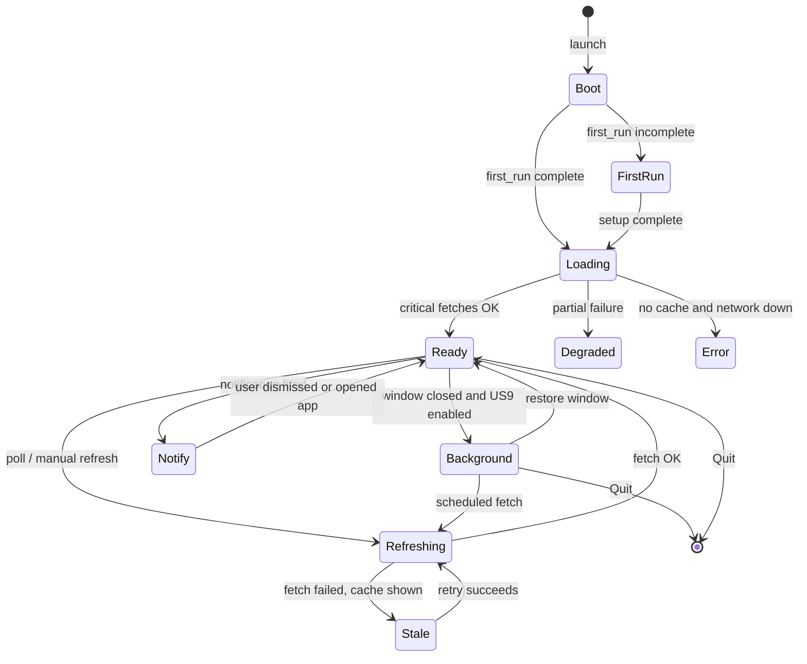

# F1 Stalker (v1)

## Overview

F1 Stalker v1 builds on the v0 dashboard (M0&ndash;M6): calendar, pins, championship charts, quali grid, weather, and offline cache. v1 adds cross-platform distribution, comparison and personalization, background presence with notifications, and onboarding polish.

**Delivery order:** cross-platform distribution → comparison and personalization → background and notifications → onboarding flow.

**Baseline:** [.specs/v0.md](./v0.md) is delivered. v1 does not remove v0 behaviour unless explicitly superseded below.

### Implementation status (current tree)

Shipped on `master` (tag `v0.1.0` and follow-up commits): v1 dashboard shell, rivalry section, theme presets, sprint grid, notifications, tray/background toggle, simplified first-run overlay, championship narrative, release CI, and macOS packaging scripts.

**In progress (uncommitted):** full standings table, global font scaling, unlimited pins, chart-section **Compare rivals**, constructor charts scoped to pinned teams, responsive typography pass, rival panel polish (team logos, layout).

| Milestone | Status | Notes |
| --------- | ------ | ----- |
| **M7** Distribution | Partial | GitHub release workflow builds per-target binaries; local macOS `.app`/DMG scripts; site hosts macOS/Windows/Linux downloads. AppImage packaging script is minimal; no installer/signing matrix in CI yet. |
| **M8** Comparison & personalization | Mostly done | Rival mode, 12 theme presets (dark/light + 10 constructors), sprint grid, pre-season toggle. Custom theme **preset id only** (no editor). Unlimited pins (supersedes v0 six-pin cap). |
| **M9** Background & notifications | Partial | `notify-rust` standings/session alerts; tray with Show/Quit; background-on-close setting. No dock hide (`LSUIElement`), no tray Refresh, no single-instance focus. |
| **M10** Onboarding | Partial | First-run overlay (timezone summary + pin count + delay notice); not a multi-step wizard. Championship narrative banner implemented. |

---

## Features

### Distribution (priority 1)

- Portable builds per CPU architecture (arm64 / x86_64)
- macOS `.app` + DMG; Windows installer or portable zip; Linux **AppImage** (FUSE)
- Desktop launcher and app icon on all platforms

### Comparison and personalization (priority 2)

- **Rival mode:** pick any two drivers from the season roster; head-to-head summary and optional chart focus via **Compare rivals**
- Constructor livery **theme presets** plus neutral **dark and light** bases
- **Custom theme** editor (colours, optional accent overrides) &mdash; preset slot reserved; editor not shipped yet
- Sprint starting grid after **Sprint Qualifying** (distinct from GP Qualifying grid in v0)
- Optional pre-season testing meetings in the calendar
- **Full standings table** (drivers and constructors; championship and latest race modes)
- **Unlimited driver pins** (duplicate pin blocked; no maximum count)
- **Font scale** control (85&ndash;135%, persisted; keyboard shortcuts and Settings)

### Background and notifications (priority 3)

- Desktop notifications when **pinned drivers' championship standings change** after new race data
- Optional session reminders (configurable; all session types supported)
- App stays in menu bar / system tray when the window is closed; restore or quit explicitly
- macOS: hide dock icon while in background (`LSUIElement` when tray mode active)

### Onboarding (priority 4)

- First-run setup: timezone confirmation, optional initial driver pins, data-delay disclaimer
- Championship narrative on the dashboard (title fight, points gap, confirmed champion when season ends)

### Platform

- Windows and Linux builds alongside macOS

---

## Tech stack

Carry forward from v0 unless noted.

| Layer | v0 | v1 change |
| ----- | -- | --------- |
| Language | Rust | unchanged |
| UI | Iced | unchanged; theme system extended (dark + light) |
| Database | SQLite | schema for notification prefs, theme, `first_run_complete` |
| OpenF1 | openf1-client (historical) | unchanged; no authenticated endpoints in v1 |
| Forecast | Open-Meteo | unchanged |
| Packaging | ad-hoc macOS scripts | CI releases: DMG, Windows artifact, Linux AppImage (FUSE) |
| Notifications | n/a | platform APIs (macOS `UserNotifications`, Windows toast, Linux portal / notify) |
| Background | n/a | tray icon crate (e.g. `tray-icon`) + single-instance policy |

---

## Data access policy

F1 Stalker v1 uses **historical OpenF1 data only**, same as v0. No OAuth, no paid subscription, no live API calls.

Per [OpenF1 docs](https://openf1.org/docs/), historical data (2023+) is free and unauthenticated, with roughly **24 hours latency** from real time.

UI copy: e.g. "Data via OpenF1 (approx. 24h delay)".

Authenticated / real-time OpenF1 is **deferred** to a future release (see [v1 scope](#v1-scope) **Out**).

---

## Glossary

All v0 terms apply. Additions:

| Term | Meaning |
| ---- | ------- |
| **Sprint grid** | Starting order for the Sprint session, from `starting_grid` after **Sprint Qualifying** (`session_name == "Sprint Qualifying"`). |
| **Rival mode** | Dashboard section comparing any two selected drivers with stats and a gap banner; **Compare rivals** narrows championship charts to that pair. |
| **Compare rivals** | Toggle in the pinned-driver chart header; when active, charts show only the two rival drivers. |
| **Standings table** | Full-grid standings section (not limited to pins): championship or latest race, drivers or constructors. |
| **Font scale** | Global UI text scale factor stored in settings (`font_scale`). |
| **Theme preset** | Named colour palette based on a constructor livery, or neutral dark/light variants. |
| **Custom theme** | User-defined palette stored in SQLite. |
| **Background mode** | App process continues after window close; icon in menu bar or system tray; dock hidden on macOS. |
| **Standings notification** | Alert when a pinned driver's championship position or points change after new race data is ingested. |
| **Pre-season testing** | Meetings outside the championship calendar (e.g. Bahrain testing). Off by default. |

### Weekend formats (v1 updates)

| | **Standard weekend** | **Sprint weekend** |
| --- | --- | --- |
| **Sprint grid source** | N/A | `starting_grid` after `Sprint Qualifying` |
| **Sprint grid UI** | N/A | Shown in weekend detail for pinned drivers (same rules as GP quali row) |
| **Sprint in countdown** | N/A | Already in v0 session list; v1 adds sprint grid row when data exists |

---

## User stories

| ID | As a… | I want to… | So that… | Scope |
| --- | ----- | ---------- | -------- | ----- |
| US0 | user | download a portable build for my CPU architecture (arm64 / x86_64) | I can run the app without installing dependencies | v1 |
| USF1 | user | have a desktop launcher and app icon | I can open the app readily | v1 |
| USF2 | user | be guided through first-run setup (timezone, optional pins) | the dashboard works correctly without reading docs | v1 |
| USF3 | fan | see who leads or has won the Drivers' Championship | I get a clear season narrative at a glance | v1 |
| USF4 | fan | use a rival mode view with exactly two drivers | I can compare two drivers head-to-head across the season | v1 |
| US6.1 | user | choose a theme from a default set of constructor livery colours | the app matches my team preference without manual tuning | v1 |
| US6.2 | user | create a custom theme | the dashboard looks the way I want | v1 |
| US8 | user | receive desktop notifications about standings changes and sessions | I am reminded without keeping the window open | v1 |
| US9.1 | user | keep the app running in the menu bar, taskbar, or tray when I close the window | it stays available without occupying my desktop | v1 |
| US9.2 | user | restore the main window from the background tray/service | I can return to the dashboard quickly | v1 |
| US9.3 | user | quit the app completely instead of sending it to the background | I can free resources when I am done | v1 |
| US10 | fan | see the sprint starting grid for pinned drivers on sprint weekends | I know how they start the Saturday sprint | v1 |
| US11 | user | run F1 Stalker on Windows or Linux | I am not limited to macOS | v1 |
| US12 | fan | enable live timing and session data during a race weekend | I can follow the session without a 24h delay | post-v1 |
| US13 | user | sync pins and settings across devices | my setup follows me | post-v1 |

v0 stories (US1&ndash;US7, USF5) remain satisfied; v1 extends them where noted in acceptance criteria.

---

## Acceptance criteria

### Distribution (US0, USF1, US11) — M7

- [x] Release artifacts: macOS (`.app` + DMG via local scripts), Windows (portable zip), Linux (tarball; AppImage script stub)
- [x] arm64 and x86_64 builds for macOS; x86_64 for Windows/Linux minimum (CI matrix)
- [x] App icon and display name consistent across dock, taskbar, and About screen
- [ ] Linux README notes AppImage + FUSE requirement (partial: README mentions AppImage/FUSE)

### Comparison and personalization — M8

#### Driver pins (extends USF5)

- [x] Pin any number of drivers (no maximum); duplicate pin blocked
- [x] Pin/unpin/reorder from pinned section and driver picker
- [x] Subtitle shows `{count} drivers pinned` (no cap display)

#### Rival mode (USF4)

- [x] **Any two drivers** from the season roster; no pin required; pick from rivalry section
- [x] Exactly two selected; change-driver replaces one slot
- [x] **Compare rivals** in chart section header activates chart focus on the pair (Drivers tab; championship and race-standing modes)
- [x] Summary strip: points, championship position, latest race result; gap banner with narrative copy
- [x] Stop comparing restores pinned-driver (or empty) chart behaviour
- [ ] Average quali position in summary (not implemented)

#### Charts (extends US4, USF5)

- [x] Section title **Pinned drivers/constructors**; drivers chart uses pinned list or rival focus
- [x] Constructors chart shows teams for **pinned drivers only** (not global top 10)
- [x] Empty states when no pins and rival compare inactive

#### Standings table (new)

- [x] Dashboard **Standings** section: full grid after latest Grand Prix
- [x] Tabs: Drivers / Constructors; modes: Championship / Latest race
- [x] Tab and mode persisted in settings (`standings_tab`, `standings_mode`)

#### Themes (US6.1, US6.2)

- [x] **12** selectable presets: neutral dark, neutral light, and 10 constructor-inspired palettes
- [x] Light theme is a full palette swap (background, surface, text)
- [x] Theme applies without restart (hot reload palette)
- [ ] WCAG AA contrast audit for all presets
- [ ] Custom theme editor: user picks accent + background + surface; stored in SQLite; export/import optional (`ThemePresetId::Custom` exists as placeholder)

#### Font scale (new)

- [x] Settings control: smaller / larger with percentage readout
- [x] Persisted in SQLite (`font_scale`, 0.85&ndash;1.35)
- [x] Global keyboard shortcuts: Cmd/Ctrl +, −, 0 (reset)
- [x] macOS View menu: Increase / Decrease Text Size

#### Sprint grid (US10)

- [x] On sprint weekends, sprint grid row for **pinned** drivers after Sprint Qualifying data exists
- [x] Session filter: `session_name == "Sprint Qualifying"` (not GP Qualifying)
- [x] Same presentation as v0 quali row: position, pole label, gap to P1
- [x] Placeholder until OpenF1 data lands (~24h delay)

#### Pre-season testing

- [x] Setting: "Include pre-season testing in calendar" (default off)
- [x] When on, testing meetings appear in triplet/countdown if returned by `meetings.list` and not cancelled
- [x] Calendar fetch filters testing when toggle off

### Background and notifications — M9

#### Notifications (US8)

- [x] User can enable/disable globally and per category (Settings toggles)
- [x] **Standings change:** notify when a **pinned** driver's championship position or points change after new race data is fetched
- [x] **Session reminders (optional):** lead time configurable (`session_reminder_minutes`, default 60)
- [x] Dedupe via standings signature and last session reminder key in settings
- [x] Copy references historical OpenF1 delay
- [ ] Formal Do Not Disturb / spam-on-retry verification

#### Background / tray (US9.1&ndash;US9.3)

- [x] Setting: "Keep running when window is closed" (default off)
- [x] Close window → hide to tray when enabled; Show restores window
- [ ] **macOS:** dock icon hidden while in background (`LSUIElement` or equivalent)
- [ ] Tray menu: Open Dashboard, **Refresh**, Quit (current: Show, Quit only)
- [x] Quit terminates process
- [ ] Single-instance: second launch focuses existing window

### Onboarding — M10

#### First-run and settings (USF2, US7)

- [x] First launch when `first_run_complete` is false → overlay on dashboard
- [x] Shows timezone, pinned driver count, and data-delay notice; **Get started** completes setup
- [ ] Multi-step wizard with editable timezone and in-flow pin picker
- [x] Settings: theme, font scale, notification toggles, background-on-close, include testing, cache controls

#### Championship narrative (USF3)

- [x] Dashboard banner: current leader name, points, gap to P2 (after latest race data)
- [x] When season complete: "World Champion: {driver}" with final points
- [x] Hidden while **Compare rivals** is active on charts
- [x] Uses same championship snapshots as charts; no extra API surface

### Cross-platform parity

- [x] Dashboard, pins, charts, weather, settings build on macOS, Windows, and Linux (CI)
- [x] Custom title bar on macOS; standard window elsewhere
- [x] SQLite and cache paths use platform data dirs (`directories` crate)

### Data freshness and errors

- [x] All v0 criteria still pass
- [x] Notification scheduler uses cached session schedule and championship snapshots; tolerates offline

---

## Data contract

### OpenF1 endpoints (additions for v1)

| F1 Stalker concern | openf1-client resource | Notes |
| ------------------ | ---------------------- | ----- |
| Sprint starting grid | `starting_grid` | `session_key` from Sprint Qualifying session |
| Session result (race) | `session_result` | Standings-change notifications; race-standing charts (v0) |

Extend openf1-client first; F1 Stalker does not duplicate serde types.

### F1 Stalker domain models (additions)

| Model | Purpose |
| ----- | ------- |
| `SprintGridSlot` | Same shape as `GridSlot`; sprint session context |
| `RivalPair` | Two `driver_number` values + comparison series |
| `ThemePreset` | Id, display name, palette tokens (dark/light aware) |
| `CustomTheme` | User overrides persisted in SQLite |
| `NotificationPrefs` | Category toggles, lead minutes, dedupe keys, last notified standings hash |
| `ChampionshipNarrative` | Headline + detail strings for dashboard banner |
| `StandingRow` | One row in the full standings table (position, label, code, accent) |

### SQLite (additions)

| Table / key | Contents |
| ----- | -------- |
| `settings` | `first_run_complete`, `theme_id`, `background_on_close`, `include_testing`, notification prefs, rival driver pair, `rival_compare_active`, `font_scale`, `standings_tab`, `standings_mode`, dedupe keys |
| `custom_themes` | user theme JSON (**planned**; not implemented) |
| `notification_prefs` | folded into `settings` key-value store (not a separate table) |

---

## Weather

No change to v0 dual-column model.

---

## State machine

### App lifecycle (v1 extensions)

| State | UI behaviour |
| ----- | ------------ |
| **FirstRun** | Welcome overlay (M10); boot screen runs before first dashboard paint |
| **Background** | Window hidden; tray/menu bar icon visible; macOS dock hidden |
| **Notify** | OS notification shown; app may stay in Background or Ready |

---

## Milestones

| Order | Milestone | Goal | Deliverables |
| ----- | --------- | ---- | ------------ |
| 1 | **M7** | Cross-platform distribution | CI builds, macOS DMG, Windows artifact, Linux AppImage (FUSE), GitHub releases (US0, USF1, US11) |
| 2 | **M8** | Comparison and personalization | Rival mode (USF4), themes dark/light + presets + custom (US6.1, US6.2), sprint grid (US10), pre-season toggle |
| 3 | **M9** | Background and notifications | Standings-change + session notifications (US8), tray/background, macOS dock hide (US9.x) |
| 4 | **M10** | Onboarding | First-run wizard (USF2), championship narrative banner (USF3) |

---

## v1 scope

**In**

- Everything in v0 scope (see [.specs/v0.md](./v0.md))
- Portable / packaged builds: macOS, Windows, Linux AppImage (US0, USF1, US11)
- Rival mode: any two drivers (USF4)
- Constructor theme presets and neutral dark/light (US6.1); custom theme editor deferred (US6.2)
- Unlimited driver pins; full standings table; global font scale
- Sprint starting grid for pinned drivers (US10)
- Desktop notifications: **pinned driver standings changes**; optional session reminders (US8)
- Background/tray mode with restore and quit; macOS dock hidden in background (US9.1&ndash;US9.3)
- Optional pre-season testing in calendar
- First-run setup and championship narrative (USF2, USF3), delivered last in the milestone order

**Out**

- Authenticated / paid OpenF1 and live timing (US12; deferred)
- Docker images
- Multi-device settings sync (US13)
- Full race companion (3D track map, telemetry explorer, radio player)
- Mobile or web clients
- Social sharing, accounts, or cloud backend operated by F1 Stalker
- Betting, fantasy, or unofficial "prediction" features

**Known limitations (document in UI)**

- All v0 limitations still apply (approx. 24h data delay)
- Standings notifications fire only after OpenF1 publishes post-race championship data
- Session reminders use cached schedule; may be wrong if the calendar changes
- Tray/background behaviour varies slightly by OS (menu bar vs system tray)
- Theme presets are constructor-*inspired*; not official branding
- Linux AppImage requires FUSE for typical mount behaviour
- Constructor championship charts only include teams with at least one pinned driver
- Rival compare is opt-in from the chart section; rivalry picks persist separately from pins
